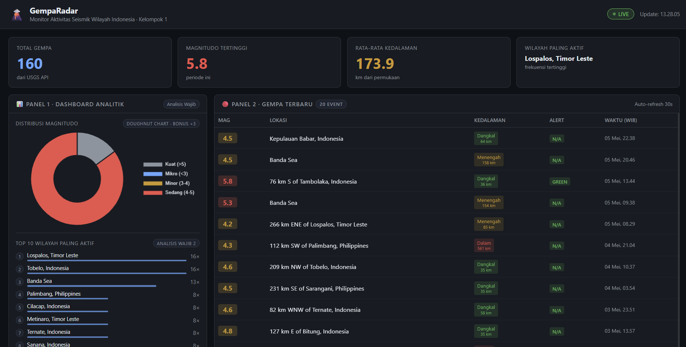

# GempaRadar: Real-Time Earthquake Monitoring System

> **ETS Big Data — Kelompok 1 | Mata Kuliah: Big Data dan Data Lakehouse**

---

## 👥 Anggota Kelompok

| NRP | Nama Lengkap | Peran |
|-----|--------------|-------|
| 5027231086 | Kharisma Fahrun Nisa` | Setup Docker (Hadoop & Kafka), buat topic, troubleshooting infrastruktur |
| 5027241079 | M. Hikari Reiziq Rakhmadinta | `dashboard/app.py` + `index.html` |
| 5027221053 | Aras Rizky Ananta | `producer_api.py` — integrasi API eksternal USGS |
| 5027241036 | Arya Bisma Putra Refman | `spark_processing.py` — 3 analisis wajib + Spark MLlib |
| 5027241058 | Ica Zika Hamizah | `producer_rss.py` + `consumer_to_hdfs.py` |

---

## 🌍 Topik: GempaRadar — Monitor Aktivitas Seismik Wilayah Indonesia

**Klien:** BPBD (Badan Penanggulangan Bencana Daerah) Provinsi

**Pertanyaan bisnis:**
> *"Di wilayah mana aktivitas gempa paling tinggi dalam periode ini, dan seberapa sering gempa signifikan (M>4) terjadi?"*

**Justifikasi:** Indonesia berada di "Ring of Fire" — zona pertemuan lempeng Indo-Australia, Eurasia, dan Pasifik — dengan frekuensi gempa tertinggi di dunia. BPBD membutuhkan sistem real-time untuk koordinasi respons kebencanaan yang cepat dan berbasis data aktual, bukan hanya laporan manual.

---

## 🏗️ Arsitektur Sistem

```
[USGS Earthquake API]      [Google News RSS]
         │                        │
         ▼                        ▼
  producer_api.py          producer_rss.py
         │                        │
         ▼                        ▼
  topic: gempa-api ──── APACHE KAFKA ──── topic: gempa-rss
                              │
                              ▼
                    consumer_to_hdfs.py
                    (Python hdfs library)
                              │
                              ▼
              ╔═══════════════════════════╗
              ║       HADOOP HDFS         ║
              ║  /data/gempa/api/*.json   ║
              ║  /data/gempa/rss/*.json   ║
              ╚═══════════╤═══════════════╝
                          │
                          ▼
               spark_processing.py
               (Batch Analysis + MLlib)
                          │
              ┌───────────┴───────────┐
              ▼                       ▼
   /data/gempa/hasil/      spark_results.json
   (HDFS output)           (Dashboard input)
                                      │
                                      ▼
                          dashboard/app.py (Flask)
                                      │
                                      ▼
                            localhost:5000
```

---

## 🚀 Cara Menjalankan Sistem

### Prasyarat

1. Docker Desktop berjalan
2. Python 3.13 terinstall
3. Tambahkan ke `C:\Windows\System32\drivers\etc\hosts` (Notepad as Administrator):
   ```
   127.0.0.1 datanode
   ```

### Step 1 — Install Python Dependencies

```sh
C:\Users\Hikar\AppData\Local\Programs\Python\Python313\python.exe -m pip install -r requirements.txt
```

### Step 2 — Jalankan Infrastruktur Docker

```sh
# Kafka
docker compose -f docker-compose-kafka.yml up -d

# Hadoop
docker compose -f docker-compose-hadoop.yml up -d

# Spark
docker compose -f docker-compose-spark.yml up -d
```

Verifikasi semua container berjalan:
```sh
docker ps
```

### Step 3 — Buat Kafka Topics

```sh
docker exec kafka-broker /opt/kafka/bin/kafka-topics.sh --create --topic gempa-api --bootstrap-server localhost:9092 --partitions 1 --replication-factor 1

docker exec kafka-broker /opt/kafka/bin/kafka-topics.sh --create --topic gempa-rss --bootstrap-server localhost:9092 --partitions 1 --replication-factor 1
```

### Step 4 — Buat Direktori HDFS

```sh
docker exec hadoop-namenode hdfs dfs -mkdir -p /data/gempa/api/
docker exec hadoop-namenode hdfs dfs -mkdir -p /data/gempa/rss/
docker exec hadoop-namenode hdfs dfs -mkdir -p /data/gempa/hasil/
docker exec hadoop-namenode hdfs dfs -chmod -R 777 /data
```

### Step 5 — Jalankan Producer & Consumer (masing-masing terminal terpisah)

```sh
# Terminal 1 — Producer API (polling USGS setiap 30 detik)
C:\Users\Hikar\AppData\Local\Programs\Python\Python313\python.exe kafka/producer_api.py

# Terminal 2 — Producer RSS (polling Google News RSS setiap 5 menit)
C:\Users\Hikar\AppData\Local\Programs\Python\Python313\python.exe kafka/producer_rss.py

# Terminal 3 — Consumer to HDFS (flush buffer ke HDFS setiap 2 menit)
C:\Users\Hikar\AppData\Local\Programs\Python\Python313\python.exe kafka/consumer_to_hdfs.py
```

Tunggu ±2 menit hingga consumer flush pertama ke HDFS.

### Step 6 — Verifikasi Kafka & HDFS

```sh
# Cek topic terdaftar
docker exec kafka-broker /opt/kafka/bin/kafka-topics.sh --list --bootstrap-server localhost:9092

# Cek consumer group & LAG
docker exec kafka-broker /opt/kafka/bin/kafka-consumer-groups.sh \
  --bootstrap-server localhost:9092 --describe --group gempa-consumer-group

# Cek file di HDFS
docker exec hadoop-namenode hdfs dfs -ls -R /data/gempa/
```

### Step 7 — Jalankan Spark Analysis

Setelah consumer flush minimal 1 kali ke HDFS:

```sh
docker exec spark-master /opt/spark/bin/spark-submit \
  --master spark://spark-master:7077 \
  /app/kafka/spark_processing.py
```

Verifikasi output Spark tersimpan di HDFS:
```sh
docker exec hadoop-namenode hdfs dfs -ls /data/gempa/hasil/
```

### Step 8 — Jalankan Dashboard

```sh
cd dashboard
C:\Users\Hikar\AppData\Local\Programs\Python\Python313\python.exe app.py
```

Buka browser: **http://localhost:5000**

---

## 📸 Screenshot

### Dashboard UI (localhost:5000)



### HDFS Web UI (localhost:9870)


### Kafka Consumer Output


> **Catatan:** Ambil screenshot dari `localhost:9870` saat Hadoop berjalan dan dari output terminal consumer, lalu simpan sebagai `image/hdfs_webui.png` dan `image/kafka_consumer.png`.

---

## ✅ Checklist Verifikasi End-to-End

```sh
# 1. Kafka: 2 topic aktif
docker exec kafka-broker /opt/kafka/bin/kafka-topics.sh --list --bootstrap-server localhost:9092
# Expected: gempa-api, gempa-rss

# 2. Kafka: consumer group LAG
docker exec kafka-broker /opt/kafka/bin/kafka-consumer-groups.sh \
  --bootstrap-server localhost:9092 --describe --group gempa-consumer-group

# 3. HDFS: file tersimpan dengan timestamp
docker exec hadoop-namenode hdfs dfs -ls -R /data/gempa/
# Expected: file JSON di /data/gempa/api/ dan /data/gempa/rss/

# 4. HDFS: hasil Spark
docker exec hadoop-namenode hdfs dfs -ls /data/gempa/hasil/
# Expected: distribusi_kedalaman/, distribusi_magnitudo/, top_wilayah/

# 5. Dashboard: data nyata dari Spark
curl http://localhost:5000/api/data
# Expected: source: "spark_hdfs", total_gempa > 0
```

---

## ⚠️ Tantangan & Solusi

| Tantangan | Solusi |
|-----------|--------|
| `kafka-python-ng` bug di Python 3.13 Windows — `subscribe()` menyebabkan `Invalid file descriptor: -1` di selectors | Menggunakan `assign()` + `seek_to_beginning()` dengan `group_id` + manual `commit()` — consumer group tetap terdaftar di broker |
| BMKG RSS tidak kompatibel dengan `feedparser` (format XML proprietary, bukan Atom/RSS standar) | Menggunakan Google News RSS: `https://news.google.com/rss/search?q=gempa+indonesia&hl=id&gl=ID` |
| Spark container worker tidak bisa connect ke master (`extra_hosts: spark-master:127.0.0.1` menyebabkan master hanya listen di loopback) | Fix `SPARK_MASTER_HOST=0.0.0.0` di `docker-compose-spark.yml` |
| `spark_results.json` placeholder menyebabkan dashboard menampilkan nol sebelum Spark dijalankan | Fallback logic di `app.py`: hitung statistik dari `live_api.json` jika `source == "placeholder"` |
| Producer deduplication dengan TTL 3600s mencegah data baru mengalir setelah cycle pertama | TTL dikurangi ke 600s (10 menit) agar ID gempa expire dan dikirim ulang secara periodik |

---

## 📁 Struktur Repository

```
kelompok-1-ets-bigdata/
├── README.md
├── docker-compose-hadoop.yml
├── docker-compose-kafka.yml
├── docker-compose-spark.yml
├── hadoop.env
├── requirements.txt
├── guide.md
├── image/
│   └── UI_Dashboard.png
├── kafka/
│   ├── producer_api.py        ← Aras Rizky Ananta
│   ├── producer_rss.py        ← Ica Zika Hamizah
│   ├── consumer_to_hdfs.py    ← Ica Zika Hamizah
│   └── spark_processing.py    ← Arya Bisma Putra Refman
└── dashboard/
    ├── app.py                 ← M. Hikari Reiziq Rakhmadinta
    ├── templates/
    │   └── index.html         ← M. Hikari Reiziq Rakhmadinta
    └── data/
        ├── spark_results.json
        ├── live_api.json
        └── live_rss.json
```
